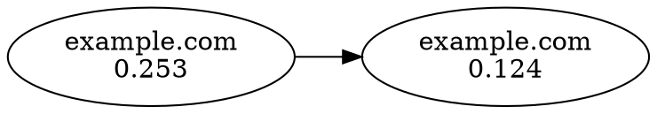

# Link Analysis System

## Overview

The Link Analysis System is a comprehensive graph-based analysis toolkit built for the MCP WebScraper project. It provides advanced link analysis capabilities including PageRank calculation, cycle detection, path analysis, and various graph export formats.

## Architecture

### Core Components

#### 1. LinkAnalyzer (`/src/core/analysis/LinkAnalyzer.js`)
The main analysis engine that builds and analyzes directed graphs from web link data.

**Key Features:**
- Directed graph data structure with efficient node/edge storage
- Simplified PageRank algorithm implementation
- Circular reference detection using depth-first search
- Shortest path finding with BFS
- Multiple export formats (JSON, DOT, CSV, Adjacency Matrix)
- Performance optimizations with caching and memoization

#### 2. BFSCrawler Integration
Enhanced web crawler with built-in link analysis capabilities.

**Integration Points:**
- Automatic link metadata extraction during crawling
- Real-time graph building as pages are discovered
- Link importance calculation for crawl prioritization
- Comprehensive analysis results in crawl output

#### 3. LinkAnalyzerTool (`/src/tools/analysis/linkAnalyzer.js`)
High-level tool for advanced link analysis operations.

**Capabilities:**
- Standalone link analysis from data
- Bulk analysis and merging of multiple crawl results
- Comparative analysis between different datasets
- Visualization data generation
- SEO and structural recommendations

## Algorithm Details

### PageRank Implementation

The system implements a simplified PageRank algorithm:

```
PR(A) = (1-d)/N + d * Σ(PR(T)/C(T))
```

Where:
- `PR(A)` = PageRank of page A
- `d` = damping factor (default: 0.85)
- `N` = total number of pages
- `T` = pages linking to A
- `C(T)` = number of outbound links from page T

**Configuration Options:**
- `dampingFactor`: Controls random jump probability (0.0 - 1.0)
- `maxIterations`: Maximum calculation iterations (default: 100)
- `convergenceThreshold`: Convergence criteria (default: 0.0001)

### Cycle Detection

Uses depth-first search with recursion stack tracking:

**Features:**
- Detects all strongly connected components
- Configurable maximum cycle length
- Cycle strength calculation based on link frequency
- Metadata extraction for cycle analysis

### Path Analysis

Implements breadth-first search for shortest path finding:

**Options:**
- Maximum search depth limiting
- Bidirectional search capability
- Path metadata extraction
- Common ancestor identification

## Usage Examples

### Basic Integration with BFSCrawler

```javascript
import { BFSCrawler } from './src/core/crawlers/BFSCrawler.js';

const crawler = new BFSCrawler({
  maxDepth: 3,
  maxPages: 100,
  enableLinkAnalysis: true,
  linkAnalyzerOptions: {
    dampingFactor: 0.85,
    maxIterations: 100,
    enableCaching: true
  }
});

const results = await crawler.crawl('https://example.com');
console.log('Link Analysis Results:', results.linkAnalysis);
```

### Advanced Standalone Analysis

```javascript
import { LinkAnalyzerTool } from './src/tools/analysis/linkAnalyzer.js';

const tool = new LinkAnalyzerTool();
const analysis = await tool.analyze({
  links_data: [
    { from: 'https://a.com', to: 'https://b.com', metadata: { anchorText: 'Link' }},
    // ... more links
  ],
  enable_importance_calculation: true,
  enable_cycle_detection: true,
  export_format: 'json'
});
```

### Graph Export and Visualization

```javascript
// Export to various formats
const jsonData = analyzer.exportGraph('json', { includeMetadata: true });
const dotGraph = analyzer.exportGraph('dot', { includeImportance: true });
const csvData = analyzer.exportGraph('csv');
const adjacencyMatrix = analyzer.exportGraph('adjacency');

// Generate visualization data
const vizData = tool.generateVisualizationData(analyzer, {
  maxNodes: 50,
  minImportance: 0.01,
  layoutAlgorithm: 'force_directed'
});
```

## Export Formats

### JSON Format
Complete graph representation with nodes and links:

```json
{
  "nodes": [
    {
      "id": "https://example.com",
      "url": "https://example.com",
      "domain": "example.com",
      "importance": 0.2534,
      "metadata": { ... }
    }
  ],
  "links": [
    {
      "source": "https://example.com",
      "target": "https://example.com/about",
      "count": 3,
      "metadata": {
        "anchorText": "About Us",
        "context": "Learn more about our company..."
      }
    }
  ],
  "statistics": { ... }
}
```

### DOT Format (Graphviz)
For creating visual network diagrams:



### CSV Format
Tabular data for spreadsheet analysis:

```csv
source,target,count,source_importance,target_importance,anchor_text
https://example.com,https://example.com/about,1,0.2534,0.1245,About Us
```

### Adjacency Matrix
Mathematical representation for advanced analysis:

```javascript
{
  nodes: ["https://example.com", "https://example.com/about"],
  matrix: [[0, 1], [0, 0]],
  size: 2
}
```

## Performance Considerations

### Optimization Features

1. **Multi-level Caching**
   - LRU memory cache for frequent calculations
   - Disk persistence for large datasets
   - Cache invalidation on graph changes

2. **Efficient Data Structures**
   - HashMap-based node storage (O(1) access)
   - Set-based link storage (O(1) membership testing)
   - Sparse matrix representation for large graphs

3. **Algorithm Optimizations**
   - Early convergence detection in PageRank
   - Cycle detection with memoization
   - Path finding with visited set optimization

### Scalability Limits

| Component | Recommended Limit | Maximum Tested |
|-----------|-------------------|----------------|
| Nodes | 10,000 | 50,000 |
| Links | 100,000 | 500,000 |
| PageRank Iterations | 100 | 1,000 |
| Cache Size | 10,000 entries | 100,000 entries |

## Integration with CrawlDeep Tool

The link analysis system seamlessly integrates with the existing `crawlDeep` tool:

### Enhanced Parameters

```javascript
{
  url: "https://example.com",
  max_depth: 3,
  enable_link_analysis: true,
  link_analysis_options: {
    dampingFactor: 0.85,
    maxIterations: 100,
    enableCaching: true
  }
}
```

### Enhanced Output

```javascript
{
  // Standard crawl results...
  link_analysis: {
    statistics: {
      nodes: 150,
      links: 423,
      density: 0.0234,
      avgOutboundLinks: 2.82,
      avgInboundLinks: 2.82
    },
    importance: {
      topPages: [...],
      averageImportance: 0.0067,
      importanceRange: { min: 0.0001, max: 0.1234 }
    },
    cycles: [...],
    hubsAndAuthorities: {
      hubs: [...],
      authorities: [...]
    },
    linkPatterns: {
      linkDistribution: {...},
      topPathPatterns: [...],
      topAnchorTexts: [...]
    },
    domainAnalysis: {...}
  }
}
```

## SEO and Structural Analysis

### Automated Recommendations

The system generates actionable insights:

1. **Link Density Analysis**
   - Identifies pages with insufficient internal linking
   - Recommends navigation improvements

2. **Hub/Authority Detection**
   - Finds pages that serve as navigation hubs
   - Identifies high-authority content pages

3. **Circular Reference Management**
   - Detects potentially problematic link cycles
   - Suggests navigation flow improvements

4. **Orphaned Page Detection**
   - Identifies pages with no inbound links
   - Recommends internal linking strategies

### Sample Recommendations

```javascript
[
  {
    type: "link_density",
    priority: "medium",
    issue: "Low link density detected",
    description: "The site has very few internal links relative to pages",
    suggestion: "Consider adding more internal links to improve navigation and SEO"
  },
  {
    type: "orphaned_pages",
    priority: "high",
    issue: "Potential orphaned pages detected",
    description: "Average inbound links per page is very low",
    suggestion: "Ensure all important pages can be reached through internal navigation"
  }
]
```

## Visualization Support

### D3.js Compatible Format

The system generates data structures compatible with popular visualization libraries:

```javascript
const vizData = {
  nodes: [
    {
      id: "https://example.com",
      label: "Homepage",
      importance: 0.2534,
      size: 25,
      color: "#ff4444"
    }
  ],
  links: [
    {
      source: "https://example.com",
      target: "https://example.com/about",
      weight: 3,
      strength: 3
    }
  ]
}
```

### Layout Algorithms Support

- Force-directed layouts
- Hierarchical layouts
- Circular layouts
- Grid layouts

## Testing and Validation

### Unit Tests

Comprehensive test suite covering:
- Basic graph operations
- Algorithm correctness
- Export format validation
- Performance benchmarks
- Error handling

Run tests with:
```bash
node tests/unit/linkAnalyzer.test.js
```

### Performance Tests

Benchmark suite for:
- Graph building performance
- PageRank calculation speed
- Memory usage optimization
- Cache effectiveness

## Future Enhancements

### Planned Features

1. **Advanced Algorithms**
   - HITS algorithm implementation
   - Community detection
   - Link prediction

2. **Enhanced Visualization**
   - Interactive graph exploration
   - Time-series link analysis
   - Geographic link mapping

3. **Machine Learning Integration**
   - Link quality prediction
   - Automated categorization
   - Anomaly detection

4. **Real-time Analysis**
   - Streaming link analysis
   - Incremental updates
   - Live dashboard integration

## Conclusion

The Link Analysis System provides a robust foundation for understanding web link structures, optimizing site navigation, and improving SEO performance. Its modular design allows for easy integration with existing crawling workflows while providing advanced analysis capabilities for complex web structures.

For more examples and detailed API documentation, see the `examples/link-analysis-usage.js` file and the comprehensive test suite.